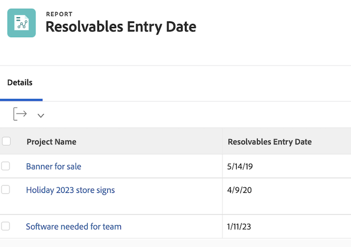

# De standaardtekstmodus voor weergaven begrijpen


>[!PREREQUISITES]
>
>* [ Begrijp rapporteringselementen ](https://experienceleague.adobe.com/docs/workfront-learn/tutorials-workfront/reporting/basic-reporting/reporting-elements.html?lang=en)
>* [ Begrijp het melden componenten ](https://experienceleague.adobe.com/docs/workfront-learn/tutorials-workfront/reporting/basic-reporting/reporting-components.html?lang=en)
>* [ creeer een basismening ](https://experienceleague.adobe.com/docs/workfront-learn/tutorials-workfront/reporting/basic-reporting/create-a-basic-view.html?lang=en)


>[!TIP]
>
>* Om een diepgaander inzicht in tekstwijze te verkrijgen adviseren wij het letten op de geregistreerde webinar gebeurtenis [ vragen de Deskundige - Inleiding aan de Wijze van de Tekst die ](https://experienceleague.adobe.com/docs/workfront-events/events/reporting-and-dashboards/introduction-to-text-mode-reporting.html?lang=en) meldt, die één uur in lengte is.
>* Om nog meer over tekstwijze te leren adviseren wij het letten op [ Geavanceerde het melden ](https://experienceleague.adobe.com/docs/workfront-learn/tutorials-workfront/reporting/advanced-reporting/welcome-to-advanced-reporting.html?lang=en) leerprogramma&#39;s, die samen vijf en een half uur in lengte zijn.
>* Klik hier voor toegang [[!UICONTROL API Explorer] ](https://developer.adobe.com/workfront/api-explorer/)

In deze video leert u:

* Welke tekstmodus is ingesteld
* Wat kamelendoosje is
* Sommige _blokken van de tekstwijze_ u in uw rapportmeningen kunt gebruiken

>[!VIDEO](https://video.tv.adobe.com/v/3410571/?quality=12&learn=on)

## De activiteiten van de &quot;Begrijpen basistekstwijze voor meningen&quot;

### Taak - 4 ouderenmening

Creeer eerst een kolom voor de Naam van de Taak en de Naam van de Ouder, dan gebruik de volgende tekstwijze om de andere drie kolommen te creëren.

#### Taak - Bovenliggend item van bovenliggende naam

```
displayname=Parent of Parent Name
linkedname=parent
namekey=view.relatedcolumn
namekeyargkey.0=parent
namekeyargkey.1=name
querysort=parent:parent:name
textmode=true
valuefield=parent:parent:name
valueformat=HTML
```

#### Taak - Bovenliggend item van bovenliggende naam

```
displayname=Parent of Parent of Parent Name
linkedname=parent
namekey=view.relatedcolumn
namekeyargkey.0=parent
namekeyargkey.1=name
querysort=parent:parent:parent:name
textmode=true
valuefield=parent:parent:parent:name
valueformat=HTML
```

#### Taak - Bovenliggend item van bovenliggende entiteit van bovenliggende naam

```
displayname=Parent of Parent of Parent of Parent Name
linkedname=parent
namekey=view.relatedcolumn
namekeyargkey.0=parent
namekeyargkey.1=name
querysort=parent:parent:parent:parent:name
textmode=true
valuefield=parent:parent:parent:parent:name
valueformat=HTML
```

 toont

### Gebruiker - Herhalingen die lijsten in gebruikersmeningen tonen

#### Gebruiker - Alle taakrollen

```
displayname=All job roles
listdelimiter=<p>
listmethod=nested(userRoles).lists
textmode=true
type=iterate
valuefield=role:name
valueformat=HTML
```

#### Gebruiker - Alle taakrollen tonen primair

```
displayname=All Job Roles showing primary
listdelimiter=<p> 
listmethod=nested(userRoles).lists 
textmode=true
type=iterate 
valueexpression=IF({user}.{roleID}={role}.{ID},CONCAT("** ",{role}.{name}," **"),{role}.{name})
valueformat=HTML
```

#### Gebruiker - Alle teams

```
displayname=All teams
listdelimiter=<p>
listmethod=nested(teams).lists
textmode=true
type=iterate
valueexpression={name}
valueformat=HTML
```

>[!NOTE]
>
>Er is een gebied van het Team toegankelijk door UI dat alle teams toont, komma&#39;s gescheiden, maar het gebruiken van de tekstwijze hierboven zal elk team op een afzonderlijke lijn tonen.


#### Gebruiker - Alle groepen

```
displayname=All groups
listdelimiter=<p>
listmethod=nested(userGroups).lists
textmode=true
type=iterate
valuefield=group:name
valueformat=HTML
```

#### Gebruiker - Alle groepen die homegroep tonen

```
displayname=All groups showing home group
listdelimiter=<p>
listmethod=nested(userGroups).lists
textmode=true
type=iterate
valueexpression=IF({user}.{homeGroupID}={group}.{ID},CONCAT("** ",{group}.{name}," **"),{group}.{name})
valueformat=HTML
```


#### Gebruiker - Directe rapporten

```
displayname=Direct reports
listdelimiter=<p>
listmethod=nested(directReports).lists
textmode=true
type=iterate
valueexpression={name}
valueformat=HTML
```

#### Gebruiker - Toekomstige PTO

```
displayname=Future PTO
listdelimiter=<br>
listmethod=nested(reservedTimes).lists
namekey=group.plural
textmode=true
type=iterate
valueexpression=IF({startDate}>$$TODAY,CONCAT({startDate}," - ",{endDate}),"")
valueformat=HTML
width=150
```


### Taak - hoe te om taaktaken te tonen en aan status te werken

```
displayname=Assignments and Status
listdelimiter=<br>
listmethod=nested(assignments).lists
namekey=group.plural
textmode=true
type=iterate
valueexpression=CONCAT({assignedTo}.{name},IF(ISBLANK({assignedTo}.{name}),"",IF({status}="AA"," - Requested",IF({status}="AD"," - Working"," - Done"))))
valueformat=HTML
width=150
```

 toont


### Taak - hoe te om rol en toewijzing op veelvoudige taaktaken te tonen

#### Taak - Rol + uren

```
displayname=Role+hours
listdelimiter=<li>
listmethod=nested(assignments).lists
textmode=true
type=iterate
valueexpression=CONCAT({role}.{name}," (",round({workRequired}/60,2),")")
valueformat=HTML
```

#### Taak - Toewijzing + percentage toewijzing

```
displayname=Assignment+percent
valueexpression=CONCAT({assignedTo}.{name}," (",{assignmentPercent},")")
listdelimiter=<li>
listmethod=nested(assignments).lists
valueformat=HTML
textmode=true
type=iterate
```

 toont

### Taak - Voorgangers en opvolgers voor meerdere projecten

#### Taakfilter (optioneel)

**toon me alle taken die minstens één dwars-projectvoorganger of minstens één dwars-projectopvolger op huidige projecten** hebben

```
predecessorsMM:ID_Mod=notblank
predecessorsMM:projectID=FIELD:projectID
predecessorsMM:projectID_Mod=ne
project:statusEquatesWith=CUR
project:statusEquatesWith_Mod=in
OR:1:project:statusEquatesWith=CUR
OR:1:project:statusEquatesWith_Mod=in
OR:1:successorsMM:ID_Mod=notblank
OR:1:successorsMM:projectID=FIELD:projectID
OR:1:successorsMM:projectID_Mod=ne
```

#### Taak - toon voorgangersnamen en projectvoorganger binnen is

```
displayname=Predecessor names
listdelimiter=<br>
listmethod=nested(predecessors).lists
namekey=group.plural
textmode=true
type=iterate
valueexpression=CONCAT("TASK = ",{predecessor}.{name}," >> PROJECT = ",{predecessor}.{project}.{name})
valueformat=HTML
width=150
```

#### Taak - toon de namen van de opvolger en de projectopvolger binnen

```
displayname=Successor names
listdelimiter=<br>
listmethod=nested(successors).lists
namekey=group.plural
textmode=true
type=iterate
valueexpression=CONCAT("TASK = ",{successor}.{name}," >> PROJECT = ",{successor}.{project}.{name})
valueformat=HTML
width=150
```

#### Taak - Verwachte voltooiingsdatum van voorgangers weergeven

```
displayname=Predecessor projected completion dates
valueformat=atDate
listdelimiter=
textmode=true
width=90
stretch=0
valuefield=predecessor:projectedCompletionDate
type=iterate
listmethod=nested(predecessors).lists
shortview=false
```

#### Taak - de vooruitgangsstatus van predecessors tonen

```
displayname=Predecessor progress status
listdelimiter=<br>
listmethod=nested(predecessors).lists
shortview=false
stretch=0
textmode=true
type=iterate
valueexpression=IF({predecessor}.{progressStatus}="OT","On Time",IF({predecessor}.{progressStatus}="LT","Late",IF({predecessor}.{progressStatus}="BH","Behind","At Risk")))
valueformat=HTML
width=90
```

#### Taak - toon percent volledig van het cross-project voorgangersproject

```
displayname=Predecessor project percent complete
listdelimiter=<br>
listmethod=nested(predecessors).lists
namekey=group.plural
textmode=true
type=iterate
valueexpression=IF({isCP}=true,CONCAT({predecessor}.{project}.{percentComplete},"%"),"")
valueformat=HTML
width=150
```


### Taak - Herhaling die alle toegewezen personen toont en wie elk toewees

```
displayname=All assignees and requesters
listdelimiter=<p>
listmethod=nested(assignments).lists
textmode=true
type=iterate
valueexpression=CONCAT("Assigned To: ",{assignedTo}.{name},"; Requested By: ",{assignedBy}.{name})
valueformat=HTML
```

 toewezen

### Taak/project - Herhaling die alle douaneformulieren op een project of een taak toont

```
displayname=All Forms Assigned
listdelimiter=<p>
listmethod=nested(objectCategories).lists
textmode=true
type=iterate
valuefield=category:name
valueformat=HTML
```


### Project - Herhaling die alle primaire contacten voor oplosbare middelen in projectweergave toont

```
displayname=Requestor
listdelimiter=<br>
listmethod=nested(resolvables).lists
namekey=group.plural
textmode=true
type=iterate
valuefield=owner:name
valueformat=HTML
width=150
```


### Project - Herhaling die alle leden van het projectteam toont

```
displayname=Project Team Members
listdelimiter=<br>
listmethod=nested(projectUsers).lists
namekey=group.plural
textmode=true
type=iterate
valuefield=user:name
valueformat=HTML
```

 toont

### Project - herhaling met vermelding van de entryDate voor alle oplosbare problemen voor een project

```
displayname=Resolvables entry date
linkedname=direct
listdelimiter=<br>
listmethod=nested(project.resolvables).lists
listsort=string(description)
querysort=description
section=0
textmode=true
type=iterate
valuefield=entryDate
valueformat=HTML
```



### Project - Toon de huisgroep van de oorspronkelijke projectaanvrager

```
displayname=Requestor home group
linkedname=direct
namekey=name
querysort=convertedOpTaskOriginator:homeGroup:name
textmode=true
valuefield=convertedOpTaskOriginator:homeGroup:name
valueformat=HTML
```


### Project - toon als het project een verzoekrij is

```
querysort=queueDef:isPublic
valueformat=val
description=0 (None), 1 (Public), 2 (Private), 3 (Company), 4 (Group)
linkedname=direct
textmode=true
enumtype=PROJ
valuefield=queueDef:isPublic
namekey=status
type=enum
enumclass=com.attask.common.constants.ProjectStatusEnum
displayname=Public Selection
```

 toont

### Probleem - herhaling met alle leden van het projectteam voor het oplossen van problemen

```
displayname=Resolve Project: Team Members
listdelimiter=<br>
listmethod=nested(resolveProject.projectUsers).lists
namekey=group.plural
textmode=true
type=iterate
valuefield=user:name
valueformat=HTML
width=150
```


### Probleem - herhaling met alle teams van de primaire contactpersoon van de uitgave

```
displayname=Requestor Teams
listdelimiter=<br>
listmethod=nested(owner.teams).lists
namekey=group.plural
textmode=true
type=iterate
valuefield=name
valueformat=HTML
width=150
```

 toont

### Document - herhaling van map in een documentrapport

```
displayname=Folder
listdelimiter=<br><br>
listmethod=nested(folders).lists
textmode=true
type=iterate
valuefield=name
valueformat=HTML
```


### Document - herhaling met bovenliggende map in een documentrapport

```
displayname=Parent Folder
listdelimiter=<br><br>
listmethod=nested(folders).lists
textmode=true
type=iterate
valuefield=parent:name
valueformat=HTML
```


### Document - Datum goedkeuring document

```
displayname=Document approval dates
valueformat=HTML
listdelimiter=<br>
linkedname=direct
textmode=true
listsort=string(description)
valuefield=approvalDate
type=iterate
listmethod=nested(approvals).lists
shortview=false
section=0
```


### Goedkeuringen proefdrukken

#### Goedkeuring proef - Naam van project tonen

```
displayname=Project Name
textmode=true 
valuefield=documentVersion:document:project:name 
valueformat=HTML
```

#### Goedkeuring proefdrukken - Taaknaam tonen

```
displayname=Task Name
textmode=true 
valuefield=documentVersion:document:task:name 
valueformat=HTML
```

 toont
