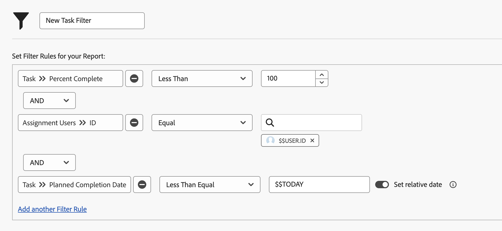

# Filters maken met jokertekens op basis van datum

In deze video leert u hoe u:

* Weet wanneer op datum gebaseerde jokertekens moeten worden gebruikt
* Begrijp het verschil tussen de twee op datum-gebaseerde vervangingen van Workfront
* Een jokerteken op basis van datum toevoegen aan een filter
* Een aangepaste datum maken met jokertekens, kenmerken, operatoren en wijzigingstoetsen
* Een aangepast datumbereik maken met jokertekens

>[!VIDEO](https://video.tv.adobe.com/v/336812/?quality=12&learn=on)

## Activiteitenvragen

1. Hoe zou u de filterregel bouwen als u kwesties wilt die een verouderde datum van gisteren of vandaag hebben?
1. Hoe zou u de filterregel bouwen om projecten te vinden die vorige week werden verwacht?
1. De volgende filterregels maken deel uit van een taakrapport u regelmatig gebruikt. Welk soort resultaten krijgt u uit dit verslag?

## Antwoorden

1. Filter op de geplande afsluitdatum van de uitgave tussen [!UICONTROL $$TODAY-1d] en [!UICONTROL $$TODAY].
1. Filter op de geplande einddatum van het project tussen [!UICONTROL $$TODAYb-1w] en [!UICONTROL $$TODAYe-1w].
1. In dit rapport worden taken gevonden die aan u zijn toegewezen en die nog niet zijn voltooid (met andere woorden een percentage voltooid hebben dat kleiner is dan 100) en die op dit moment achterstallig of opeisbaar zijn. De filterregel voor de geplande voltooiingsdatum van de taken zegt om taken te bekijken die een vervaldatum gelijk aan of vóór de datum van vandaag hebben.
