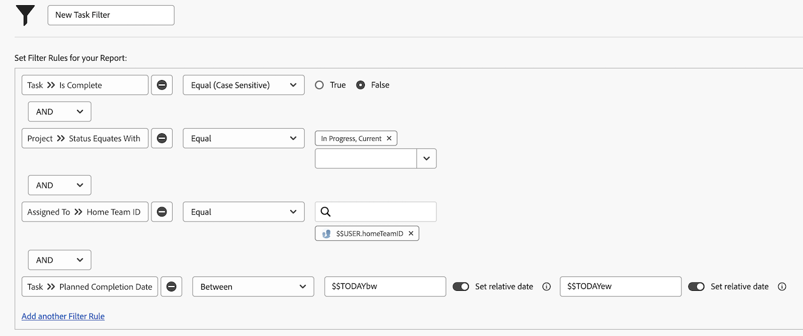

# Filters maken met jokertekens op basis van gebruiker

In deze video leert u hoe u:

* Begrijp waarom om vervangingen te gebruiken
* Een filter maken met een op gebruikers gebaseerd jokerteken

>[!VIDEO](https://video.tv.adobe.com/v/336810/?quality=12&learn=on)

>[!TIP]
>
>Gebruik de het gebiedsbron en naam van de Gebruikers van de Taak > van identiteitskaart wanneer het bouwen van filters die taak bekijken of taakinformatie uitgeven.  Bij deze optie wordt naar alle   gebruikers die zijn toegewezen aan de taak of uitgave, niet alleen de &quot;eigenaar&quot; of de primaire ontvanger.

>[!TIP]
>
>Gebruik de $$USER.ID (in plaats van uw naam) zelfs wanneer het bouwen van filters voor zich. Als iemand dan een filter ziet dat u gebruikt en zegt: &quot;Deel dat met mij&quot;, is het filter al ingesteld, zodat elke gebruiker die het filter gebruikt zijn eigen informatie ziet.

>[!TIP]
>
>U moet altijd de Gelijke filterkwalificatie gebruiken wanneer het gebruiken van op gebruiker-gebaseerde vervangingen.

## Activiteit

Deze week hebt u wat extra tijd, dus u wilt zien of er iemand in uw team is die hulp kan gebruiken bij het toewijzen van taken. Maak een taakfilter om te zoeken naar taken die deze week moeten worden uitgevoerd en die nog niet zijn voltooid.

## Antwoord

U bent fantastisch om uw teamgenoten te helpen! Als het filter is ingesteld zoals in de onderstaande afbeelding, vindt u taken:

* die nog niet zijn voltooid (dit houdt in dat ze geen [!UICONTROL Complete] -status of -status hebben die gelijk is aan [!UICONTROL Complete] );
* die zich bevinden in projecten met een [!UICONTROL Current] -status (u wilt immers geen taken zoeken voor projecten die nog niet zijn gestart);
* die aan iemand in uw huisteam worden toegewezen, zoals die door de teammontages van Workfront wordt bepaald;
* En die een voltooiingsdatum van enige tijd deze week hebben (deze regel gebruikte het vooraf gebouwde datumfilter om &quot;deze week&quot;te bepalen).

 tot stand te brengen

Mogelijk moet u extra filters toevoegen als u de lijst een beetje meer wilt beperken. U kunt bijvoorbeeld een filterregel toevoegen die een specifiek programma of portfolio bekijkt waarvan uw team werkt.
