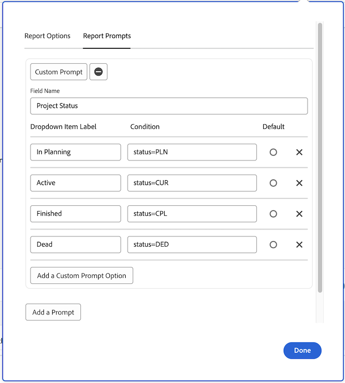
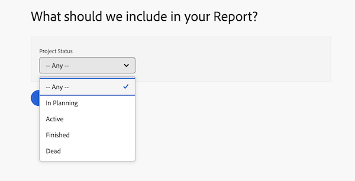

# Aangepaste vragen maken

In deze video leert u:

* Wat een aangepaste prompt is
* Een aangepaste vraag maken met de tekstmodus
* Enkele voorbeelden die u in uw rapportage kunt gebruiken

>[!VIDEO](https://video.tv.adobe.com/v/336822/?quality=12&learn=on)

## Aangepaste herinneringsactiviteiten maken

[ klik hier ](/help/assets/create-custom-prompts-activities.pdf) om een PDF van deze pagina te downloaden.

## Activiteit: Aangepaste aanwijzingen maken

1. Creeer een douaneherinnering die de volgende projectstatussen in het snelle drop-down menu toont:
   * Planning
   * Huidig
   * Voltooid
   * Dead
1. Wijzig de herinnering om huidige projecten te tonen die deze maand worden verwacht.

## Antwoorden

1. Uw aangepaste aanwijzingen moeten er ongeveer als volgt uitzien en de volgende tekstmodus hebben:

    tot stand te brengen

   Zodra u sparen de douaneherinnering, zou het snelle drop-down menu als dit moeten kijken:

1. De tekstmodus in de aangepaste prompt moet er als volgt uitzien:

 tot stand te brengen

```
   status=CUR&plannedCompletionDate=$$TODAYbm&plannedCompletionDate_Mod=between&plannedCompletionDate_Range=$$TODAYem 
```

En het drop-down etiket voor actieve herinneringen zou moeten worden bijgewerkt om op de verandering in de code als dit te wijzen:

 tot stand te brengen
