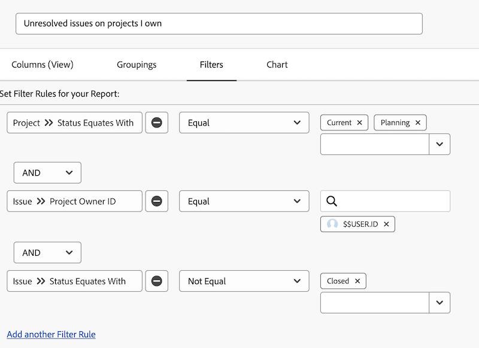

# Ingebouwde uitgiftefilters begrijpen

In deze video zult u:

* Bekijk ingebouwde uitgiftefilters om te zien hoe ze zijn gemaakt
* Meer informatie over enkele handige rapportelementen voor problemen
* Leer hoe u uw eigen filter voor uitgaven maakt

>[!VIDEO](https://video.tv.adobe.com/v/336819/?quality=12)

## Activiteit: Een probleemrapport maken

U wilt alle problemen zien die nog moeten worden opgelost voor alle actieve projecten die u hebt, inclusief problemen met een oplossend object. Maak een probleemrapport en noem het &quot;Onopgeloste problemen met projecten die ik bezit.&quot;

## Antwoord

Zo ziet het filter eruit:

In het ingebouwde filter &quot;Mijn open kwesties&quot; sluit een van de filterregels problemen uit waarbij een object is opgelost. De redenering achter deze is dat u zich geen zorgen hoeft te maken over deze kwesties. Iemand heeft al een project, taak of probleem gemaakt dat ze zal oplossen. Wat is er dan aan te merken? Maar ze zijn nog niet opgelost en in ons voorbeeld maken we ze beschikbaar om ze gemakkelijk te kunnen identificeren en controleren.

Hiervoor moet u op het tabblad Weergave een kolom toevoegen voor &#39;&#39;Uitgave > > Object oplossen&#39;&#39;. Dit toont de naam van het het oplossen voorwerp, als er is, of het een project, een taak, of een kwestie is. Als u op de naam klikt, gaat u naar het oplossende object.

U zou de lijst kunnen willen groeperen die op de naam van het project wordt gebaseerd.

Zo ziet het verslag eruit:

