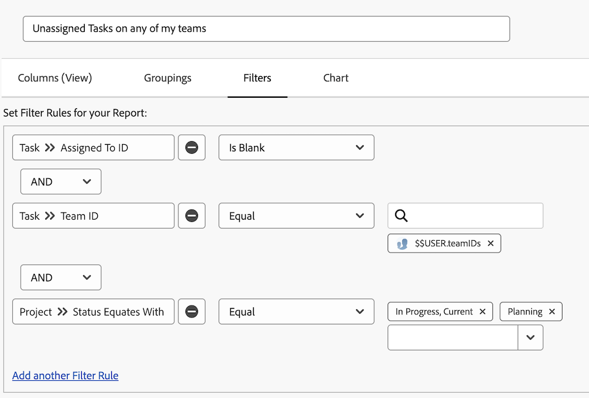

# Ingebouwde taakfilters begrijpen

In deze video zult u:

* Bekijk ingebouwde taakfilters om te zien hoe ze zijn gebouwd
* Meer informatie over enkele handige taakrapportelementen
* Leer hoe u uw eigen taakfilter maakt

>[!VIDEO](https://video.tv.adobe.com/v/3469594/?captions=dut&quality=12&learn=on&enablevpops=0)

## Activiteiten van ingebouwde taakfilters begrijpen

### Activiteit: Een taakrapport maken

U wilt ervoor zorgen dat u zich bewust bent van taken die aan een van uw teams zijn toegewezen en die niemand heeft toegezegd om er nog aan te werken. Creeer een taakrapport genoemd &quot;Niet toegewezen Taken op om het even welk van mijn teams.&quot;

### Antwoord

Zo ziet het filter eruit:

 tot stand te brengen

Stel de kolomweergave in om de velden op te nemen waarin u geïnteresseerd bent of waarin u online wilt kunnen bewerken. Bijvoorbeeld, kon u een kolom van Toewijzingen omvatten zodat kon u een teamlid aan een taak direct van het rapport toewijzen.

U zou de lijst kunnen willen groeperen die op de naam van het team wordt gebaseerd aan elke taak wordt toegewezen.

Zo ziet het verslag eruit:

