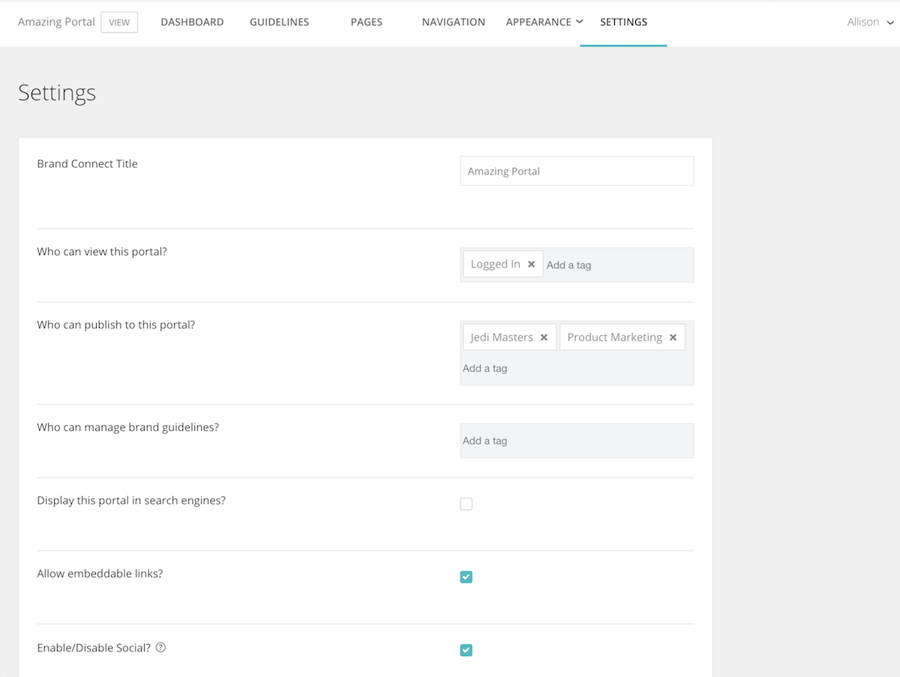

# Systeeminstellingen vaststellen in [!UICONTROL Brand Connect]

De [!UICONTROL Brand Connect] met instellingen bepaalt u wie het portaal kan zien, wie inhoud naar het portaal kan publiceren en wie de richtlijnen voor het merk kan beheren.

Meld u aan om de instellingen te openen [!UICONTROL Workfront DAM].

1. Klik op de knop **instellingenpictogram** in de navigatiebalk en selecteer **[!UICONTROL Brand Connect]**. Of klik op **[!UICONTROL Brands]** in de navigatiebalk.
1. Klik vervolgens op de knop **[!UICONTROL Edit]** in de rechterbovenhoek van het dialoogvenster [!UICONTROL Brand Connect] deelvenster. Als uw organisatie meerdere [!UICONTROL Brand Connects], zorg dat u de juiste bewerkt.

Praat met uw [!UICONTROL Workfront] als u vragen hebt over deze instellingen.

* **[!UICONTROL Brand Connect]Titel**—Geef de naam [!UICONTROL Brand Connect] (of wijzig de naam).
* **Wie kan dit portaal bekijken?**—Stel de groepen in die de [!UICONTROL Brand Connect]. Als u bijvoorbeeld de opdracht [!UICONTROL Logged In] groep, dan kunnen alle geregistreerde gebruikers het portaal zien. De mapmachtigingen zijn echter nog steeds van toepassing, dus ook al kan een gebruiker de portal zien, hij of zij heeft alleen toegang tot de middelen als de [!UICONTROL Logged In] groep kreeg machtigingen voor de map.
* **Wie kan op dit portaal publiceren?**—Stel de groepen in die elementen kunnen publiceren in op de knop [!UICONTROL Brand Connect]. Dit zijn contributiegroepen. Ze kunnen alleen items publiceren waartoe ze toegang hebben.
* **Wie kan de richtlijnen voor merken beheren?**—Stel de groepen in die de merkenrichtlijnen kunnen beheren. Het beheren van de richtlijnen is niet beperkt tot beheerders. U kunt een contributorgroep instellen om de richtlijnen te bewerken.
* **Dit portaal weergeven in zoekprogramma&#39;s?**—Wilt u de [!UICONTROL Brand Connect] URL om te tonen wanneer mensen onderzoeken op Internet in werking stellen?
* **Insluitbare koppelingen toestaan?**—Kan insluitbare koppelingen afkomstig zijn van de [!UICONTROL Brand Connect]? Hiermee voegt u een [!UICONTROL Get Links] aan de [!UICONTROL Share] menu dat insluitbare koppelingen voor het element bevat.
* **Sociaal inschakelen/uitschakelen?**—Als social is ingeschakeld (selectievakje), kunnen gebruikers elementen leuk vinden en opmerkingen plaatsen.
* **Downloaden en tellen inschakelen/uitschakelen?**—Als deze optie is ingeschakeld, kunnen gebruikers zien hoe vaak een element is gedownload en hoeveel opmerkingen het heeft.
* **Elementen in eerste instantie verbergen**—Verberg de zoekfilters voor metagegevens die in het linkerdeelvenster van het dialoogvenster [!UICONTROL Assets] pagina.
* **Label voor lichtbak**—Selecteer een label voor [!UICONTROL Lightboxes] — [!UICONTROL Lightbox], [!UICONTROL Collection], [!UICONTROL Favorites], of [!UICONTROL Favourites].
