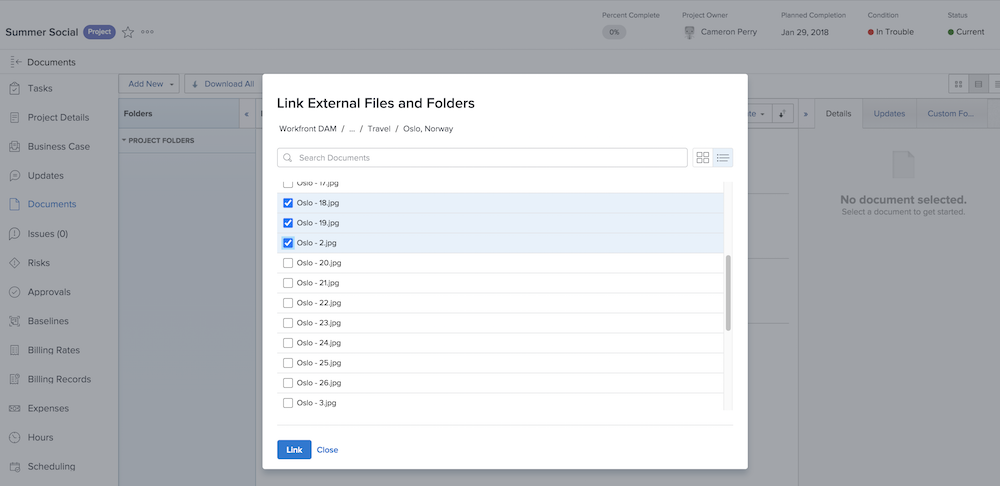

# Voeg een [!UICONTROL Workfront DAM] link

Start door de verbinding tussen de twee systemen in te stellen.

1. Aanmelden bij [!DNL Workfront].
1. Een project, taak of uitgave openen en op de knop **[!UICONTROL Documents]** tab.
1. Klik op de knop **[!UICONTROL Add New]** en selecteert u **[!UICONTROL From Workfront DAM]** in het keuzemenu.
1. Voer uw aanmeldingsnaam en wachtwoord in het dialoogvenster [!UICONTROL Workfront DAM] machtigingsvak dat wordt weergegeven.
1. Klik op Volgende **[!UICONTROL Yes]** geven [!DNL Workfront] toegang tot de [!UICONTROL DAM] account.
1. Vernieuw indien nodig de pagina om de toegang tot [!UICONTROL Workfront DAM].

Nu kunt u een koppeling naar de [!UICONTROL Workfront DAM] item in [!DNL Workfront].

1. Aanmelden bij [!DNL Workfront].
1. Een project, taak of uitgave openen en op de knop **[!UICONTROL Documents]** tab.
1. Klik op de knop **[!UICONTROL Add New]** en selecteert u **[!UICONTROL From Workfront DAM]** in het keuzemenu.
   ![Een afbeelding van de [!UICONTROL From Workfront DAM] in de [!UICONTROL Add New] vervolgkeuzemenu](assets/01-contributor-from-workfront-dam.png)
1. Een lijst met bestanden en mappen waartoe u toegang hebt in [!UICONTROL Workfront DAM] in het venster.

1. Zoek het element dat u zoekt en schakel het selectievakje naast het element in. De standaardweergave is een lijst, maar u kunt overschakelen naar een miniatuurweergave met de pictogrammen in de rechterbovenhoek van het venster.

   

1. Klik op de knop **[!UICONTROL Link]** knop. Een koppeling naar de [!UICONTROL Workfront DAM] wordt weergegeven in de documentenlijst. Een pictogram geeft deze koppeling aan.

   ![Een afbeelding van de koppelingen naar de [!UICONTROL Workfront DAM] bestanden die worden weergegeven in de documentenlijst van [!DNL Workfront].](assets/03-contributor-linked-in-wf.png)
