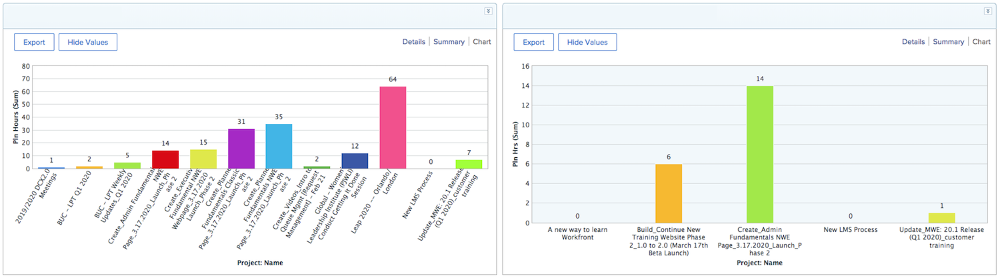
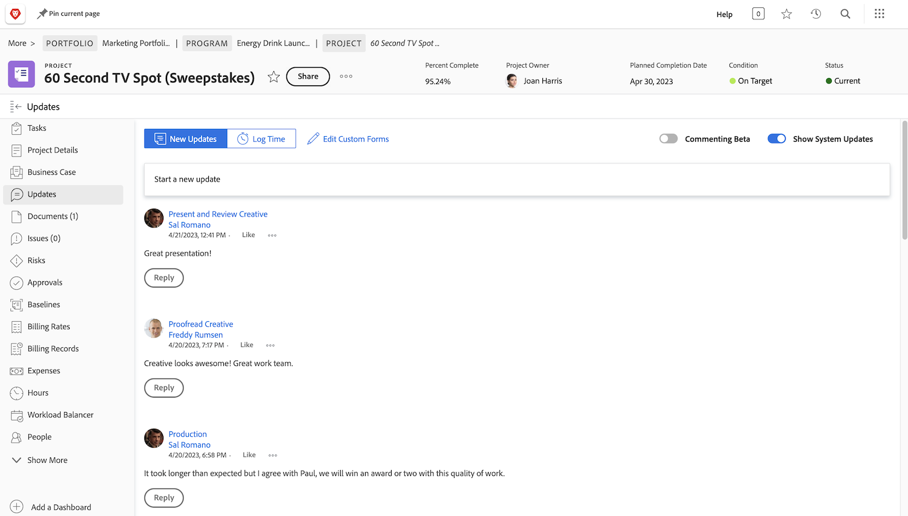

# Workfront voor leidinggevenden

Leer hoe Workfront u kan helpen uw werk in uw organisatie te beheren.

Als uitvoerend directeur kan Adobe Workfront:

* Houd je op de hoogte van de voortgang van het werk waarover je je zorgen maakt **rapporten en dashboards**
* Geef u een gemakkelijke manier om **communiceren met belanghebbenden van projecten met behulp van updates**
* Geef u een gemakkelijke manier om **een werkverzoek indienen**
* Geef je een eenvoudige manier om te zien **objecten die nog moeten worden goedgekeurd**

## Rapporten en dashboards

### Rapporten

Rapporten in Workfront zijn de ruggengraat voor betere beslissingen, sneller. U kunt hen overal zien u-in het projectgebied, het personengebied, of op een taak het landen pagina gaat.

De leiders en de managers kunnen aan het rapportgebied navigeren om douanerapporten met specifieke informatie te bekijken. Workfront maakt gebruik van dashboards om de zichtbaarheid van de belangrijkste rapporten te vergroten.

### Dashboards

Door een dashboard te gebruiken, kunnen de leiders in om het even welk deel van het werk bekijken en snel boren hun organisatie momenteel werkt aan.Het dashboard is eenvoudig een inzameling van rapporten die informatieleiders kunnen op een regelmatige basis moeten zien. De dashboards zijn volledig aanpasbaar zodat iedereen die Workfront gebruikt werk kan zien dat voor hen van belang is.

Klik op Dashboards in het menu Main in de rechterbovenhoek om het dashboards-gebied te openen.

Leaders hebben via de navigatie in het linkerdeelvenster toegang tot de verschillende dashboards waarover ze beschikken.

* **Alle dashboards**: Hiermee geeft u de dashboards weer die u of andere gebruikers hebben gemaakt en die u minstens mogen weergeven.
* **Mijn dashboards**: Hiermee geeft u de dashboards weer die u hebt gemaakt.
* **Gedeelde dashboards**: Hiermee geeft u de dashboards weer die door andere gebruikers zijn gemaakt en met u zijn gedeeld.

Met een dashboard kunnen leiders dingen als &quot;Kosten, Ontvangsten &amp; Begrotingen,&quot;voor belangrijke projecten en open kwesties herzien hun teams behandelen. Zij kunnen ook projecten zien die in gevaar zijn, evenals een lijst van punten die uitvoerende goedkeuring vereisen.

Rapporten in Workfront kunnen uw werknemers helpen verantwoording af te leggen. De sleutel tot het leveraging van rapporten is een duidelijke workflow voor de manier waarop uw organisatie deze gebruikt. Zorg ervoor dat iedereen goed begrijpt welke verslagen worden gebruikt om succes te meten.

Voorbeeld van rapporten in een dashboard in Workfront

## Communiceren met belanghebbenden van projecten door updates te gebruiken

Communiceer met het projectteam binnen het project zelf zodat zullen alle projectmededelingen gemakkelijk toegankelijk zijn.

## Een aanvraag indienen

In veel organisaties is de eerste stap bij het opstarten van een nieuw project, het ontwikkelen van een nieuw product of het creëren van een leverbaar een aanvraag in Workfront. U kunt de voortgang van het verzoek volgen en aanvullende informatie verstrekken wanneer dat nodig is.

In deze video leert u hoe u:

* Ga naar het aanvraaggebied
* Een aanvraag indienen
* Verzonden verzoeken bekijken

>[!VIDEO](https://video.tv.adobe.com/v/336092/?quality=12&learn=on)

## Objecten die nog moeten worden goedgekeurd

In [!UICONTROL Home] je kunt gemakkelijk objecten vinden die je nog moet goedkeuren.

