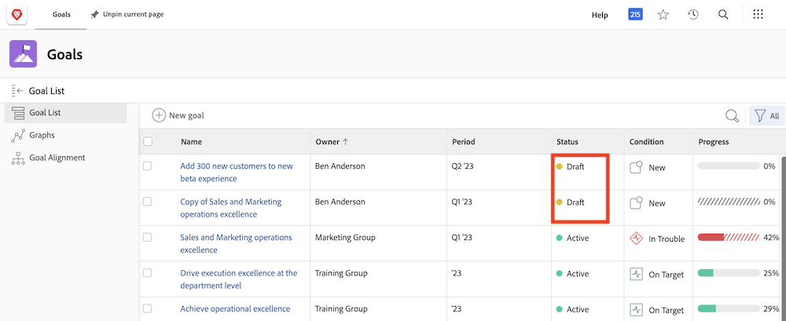
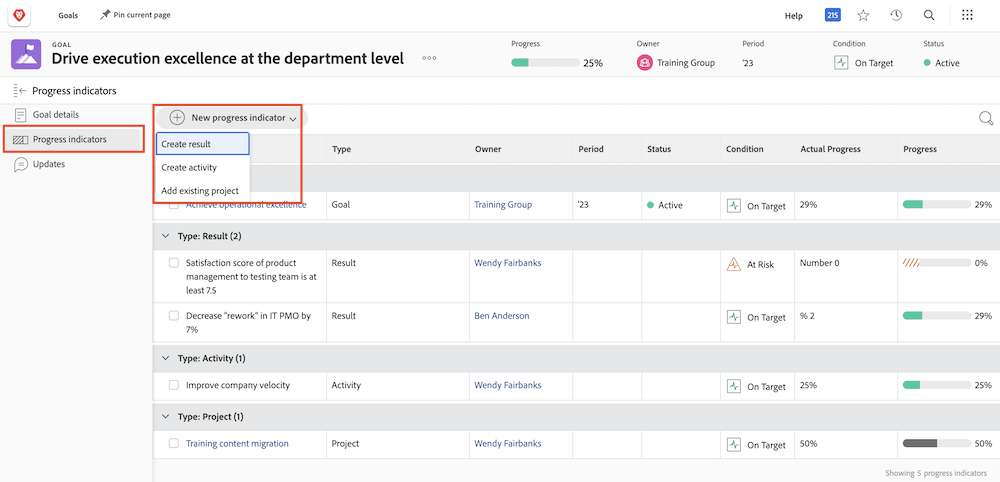

# Doelstellingen activeren

Nu u doelstellingen hebt gecreeerd, laten wij hen activeren! Wanneer u een doel maakt, wordt het opgeslagen in [!UICONTROL Draft] status. [!UICONTROL Draft] de doelstellingen zijn geen deel van doelbeheer tot u hen activeert. Als ze eenmaal zijn geactiveerd, schakelen ze over op een [!UICONTROL Active] status en geef de voortgang in het dashboard weer en hoe deze zich aan de algemene strategie aanpassen. Doelen in [!UICONTROL Active] status wordt geassocieerd met een vooruitgangsindicator-gewoonlijk een activiteit, een resultaat, een project of een gericht doel (kind-ouder doelverhouding).

## Voortgangsindicatoren zijn vereist om doelstellingen te activeren

Voordat u verdergaat, is het belangrijk dat u de voortgangsindicatoren begrijpt die worden gebruikt in [!DNL Workfront Goals]. Voortgangsindicatoren zijn de objecten in [!DNL Goals] gebruikt om de voortgang van een doel te berekenen. De voortgangsindicatoren zijn gerichte doelstellingen, resultaten, activiteiten, en projecten. Hierover zult u later meer in detail leren. Vooralsnog is het belangrijk te begrijpen dat gerichte doelstellingen, resultaten, activiteiten en projecten aan een doel moeten worden toegevoegd om het te activeren.

Als u een voortgangsindicator wilt toevoegen, opent u het doel en selecteert u het tabblad Voortgangsindicatoren aan de linkerkant. Vervolgens wordt het vervolgkeuzemenu Nieuwe voortgangsindicator weergegeven.

In vergelijking met andere voortgangsindicatoren zijn projecten een beetje uniek, omdat ze als een soort activiteit worden beschouwd. De activiteiten kunnen in twee types-handvooruitgangsbar en Projecten worden onderscheiden. Dit heeft tot gevolg dat projecten ook de voortgang stimuleren. Hoewel alle soorten vooruitgangsindicatoren met een ouderdoel kunnen worden verbonden, is het belangrijk om in mening te zijn dat er verschillen in de manier zijn u hen beheert.

## Activeer nu het doel

Als u minstens één voortgangsindicator op uw doel hebt, ziet u de optie Activeren wanneer u op het drie puntmenu naast de doelnaam klikt.

