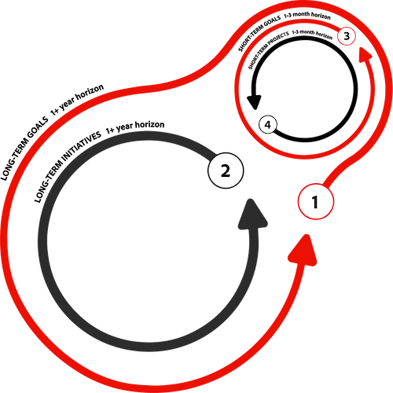
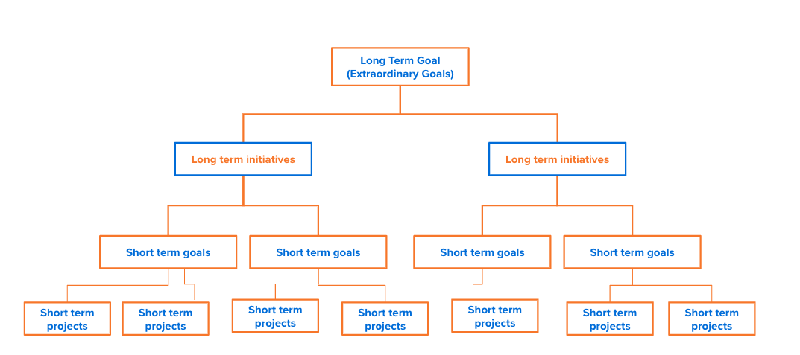

# Stel een visie en strategie voor uw org vast

In deze video leert u meer over:

* &quot;Wat&quot; en &quot;waarom&quot; tijdens de planningsfase worden gedicteerd
* Voorbeelddoelen
* Toepassingsgebied

>[!VIDEO](https://video.tv.adobe.com/v/335185/?quality=12&learn=on&enablevpops)

## Een certificaat plannen voor regelmatige controles en onderhoud

Uw vaardigheid om ceremonies, activiteiten, en controle te plannen is zo belangrijk zoals de details van het plan zelf. Moderne planning is voortdurend en fluctuerend. U zou controle, het herzien, en het aanpassen langs de weg moeten voorzien. Zo kunt u de cursus correct uitlijnen op het gewenste resultaat.

Uitlijning is afhankelijk van het creëren van een cultuur die zich kan onttrekken aan niet-beïnvloede inspanningen. Vaak staan onze projecten en hun voltooiing centraal. Hoewel we de voltooiing van het werk kunnen stimuleren, kan dit leiden tot het uiteindelijke mislukken van het bereiken van het einddoel, omdat het werk niet langer relevant is voor het oorspronkelijke resultaat.

Een traditionele ervaring voor een planningscyclus op lange termijn/op korte termijn kan 12 maanden/3 maanden bedragen. Of 6 maanden/1 maand of iets anders.

Overweeg deze concepten wanneer het bepalen van de aangewezen kadentie voor uw organisatie.

* In het huidige bedrijfsklimaat zijn interne en externe factoren volatieler en veranderen vaak. Om deze factoren op een strategische manier aan te pakken, moeten evaluaties en aanpassingen van de doelstellingen op de kortere termijn ten minste om de drie maanden plaatsvinden.

* Bij elke evaluatie moet tijd worden uitgetrokken om na te denken over de prestaties en inspanningen in het verleden en moet het ondernemingstraject voor de toekomst worden geëvalueerd. Vraag uzelf en uw teams...zitten we nog op schema?

De volgende afbeelding illustreert de relatie en het cyclische karakter van deze ervaring, tussen niet alleen doelstellingen op langere en kortere termijn, maar ook inspanningen op langere en kortere termijn.

1. **langetermijndoelstellingen** zijn typisch bredere onderneming of organisatorische doelstellingen die 12 of meer maanden zullen vergen om te bereiken. Ze worden waarschijnlijk niet uitgevoerd met speciale werkinspanningen. De meeste bedrijven en organisaties hebben een aantal niveaus van deze langetermijndoelstellingen bovenaan in de hiërarchie die kortetermijndoelstellingen verenigen onder één enkel, breed einddoel.
1. **initiatieven op lange termijn** vertegenwoordigen de raming op hoog niveau van het werkinspanning die wordt toegewezen aan aandrijvingsverrichtingen. Deze initiatieven zullen uiteindelijk worden verfijnd tot meer kostbare inspanningen (d.w.z. project, taken, enz.). Hoewel dit doorgaans langer werk is, bijvoorbeeld 12 of meer maanden, kunnen deze in sommige gevallen een groepering zijn van verschillende initiatieven van zes of meer maanden die met hetzelfde resultaat overeenkomen.
1. **kortetermijndoelstellingen** zijn de doelstellingen die door uw mensen en teams worden geplaatst die zich aan meer mijlpaal-type resultaten richten. Al deze gesegmenteerde prestaties dragen bij tot de algemene verwezenlijking van uw onderneming of organisatorische langetermijndoelstellingen.
1. **kortetermijnprojecten** verwijzen naar het meer eng bepaalde werkingsgebied van het werk dat wordt vereist om de kortetermijndoelstellingen te vervullen. Dit kunnen eenmalige projecten zijn of projecten die deel uitmaken van een breder initiatief.

<!--
Your turn graphic
-->

Laten we even oefenen en toepassen wat je tot nu toe hebt geleerd. Begin door een aanvankelijke reeks doelstellingen voor uw team in kaart te brengen. U zou dit kunnen gehoord hebben die als cascading doelstellingen of een doelhiërarchie wordt bedoeld. Let op hoe ze allemaal teruggaan naar het langetermijndoel en van daaruit worden getrapt. Maak je geen zorgen om in deze fase te definitief te zijn. Dit is uw kans om al uw doelstellingen op tafel te krijgen. We zullen deze verder verfijnen naarmate we verder gaan.

