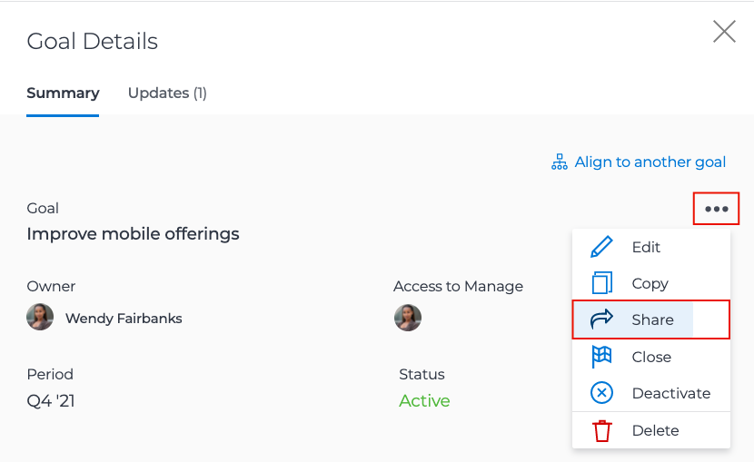

# Doelstatus communiceren

Nu u uw doelstellingen gebruikend hebt bijgewerkt [!UICONTROL Check-ins]Neem even de tijd om terug te gaan en een vogelperspectief te krijgen van de doelen waaraan u werkt en hoe ze zich verhouden tot de teamdoelen, de groep en de bedrijfsdoelen. Communiceren met anderen over de voortgang en status van uw doelen is een belangrijk onderdeel van het op één lijn houden.

Er zijn verschillende manieren om de juiste mensen op de hoogte te houden van uw doelstellingen. Je kunt beginnen met:

* Uw doelen delen en rapporteren
* De weergave instellen van het dialoogvenster [!UICONTROL Pulse] stream om afzonderlijke objectupdates te maken en weer te geven
* De [!UICONTROL Graphs] voor een uitgebreide momentopname van de voortgang van uw doelen

## Een doel delen

U kunt een doel delen u creeerde of een doel dat door iemand anders wordt gecreeerd waaraan u toestemmingen om hebt te leiden. U kunt geen doelstellingen met groepen, teams, of bedrijven delen. Als u beheermachtigingen hebt voor een doel, kunt u de machtigingen van het doel wijzigen voor de maker van het doel. Standaard heeft de persoon die het doel maakt beheermachtigingen, maar u kunt deze wijzigen in Weergave.

1. Klik op de naam van het doel dat u wilt delen vanuit een willekeurige sectie in het dialoogvenster [!DNL Goals] te openen [!UICONTROL Goal Details] deelvenster.

1. Klik op het pictogram met drie punten naast de doelnaam en klik vervolgens op [!UICONTROL **Delen**]. De [!UICONTROL Goal Access] wordt weergegeven.

   

1. Voer een van de volgende handelingen uit:

   * Selecteer [!UICONTROL Manage system-wide] instellen om beheermachtigingen te geven aan iedereen op het systeem die toegang tot Bewerken heeft [!DNL Goals] via hun [!DNL Workfront] toegangsniveau. Deze optie is standaard uitgeschakeld voor alle nieuwe doelen.
   * Typ de naam van een gebruiker die u wilt geven [!UICONTROL Manage] bevoegdheden aan in de [!UICONTROL Give Manage access to] doos. Selecteer de naam wanneer deze in de lijst wordt weergegeven.

1. Klikken [!UICONTROL **Delen**]. Een label voor het hele systeem of de namen van de gebruikers die beheermachtigingen hebben voor de doelweergave in het dialoogvenster [!UICONTROL Access to Manage] in het [!UICONTROL Goal Details] deelvenster.

## Rapport over doelinformatie

U kunt Gologische rapporten of de rapporten van het Project bouwen die informatie over bijbehorende doelstellingen in omvatten [!DNL Workfront]. Er zijn verscheidene manieren om doelinformatie in rapporten te bekijken.

* Maak een Goal-rapport in het gebied Rapporten. U kunt diverse informatie over het doel op het rapport van het Doel tonen (bijvoorbeeld: naam, eigenaar, datum, voortgang, enz.), met inbegrip van:

   * **Goal Hierarchy**—Toont alle ouderdoelstellingen en hoe zij met elkaar verbinden.
   * **Is bedrijfsdoel**—Geeft aan of uw organisatie is aangewezen als de eigenaar van een doel.
   * **Type eigenaar**— Geeft aan of de eigenaar van een doel een gebruiker, team of groep is.

* Creeer een projectrapport dat doelinformatie, met inbegrip van het volgende toont:
   * **Goal Hierarchy**—Toont alle ouderdoelstellingen en hoe zij met elkaar verbinden.
   * **Doelen**—Dit is een inzamelingsgebied dat alle doelstellingen verbonden aan een project toont.
   * **Aantal gekoppelde doelen**—Het aantal doelstellingen verbonden aan het project.
