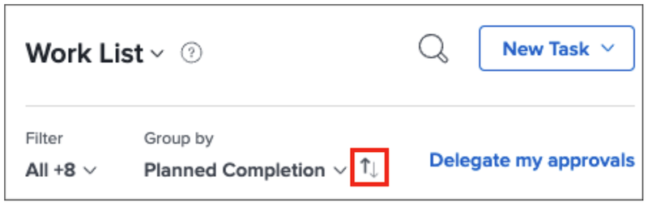

# Uw lijst met taken ordenen in [!DNL Workfront] [!UICONTROL Home]

>[!NOTE]
>
>De optie [!UICONTROL [!DNL Sort by]] in de [!UICONTROL Work List] is hernoemd naar [!UICONTROL Group by] en taken en problemen kunnen ook worden gegroepeerd door de [!UICONTROL Planned Start Date] .

In deze video leert u hoe u:

* Werktoewijzingen sorteren
* Werktoewijzingen filteren op type
* Identificeer werk dat klaar is om te beginnen
* Werktoewijzingen accepteren

>[!VIDEO](https://video.tv.adobe.com/v/335099/?quality=12&learn=on&enablevpops)

>[!NOTE]
>
>Standaard staan de oudste items die u hebt, boven aan de [!UICONTROL Work List] . Als u uw het werkpunten in dalende orde wilt hebben verschijnen, klik de pijlen rechts van de Groep door gebied.

