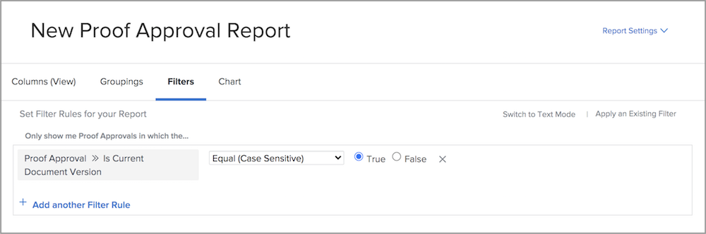
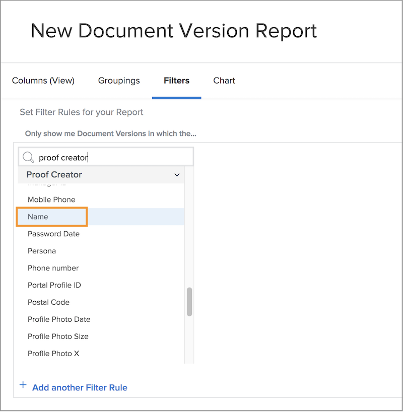

# Proefverslagen

Met de functies voor digitale proefdrukken van [!DNL Workfront] kunt u projecten en gerelateerde workflows voor revisie op één locatie beheren — [!DNL Workfront] . Verkrijg waardevol inzicht in het het proefdrukken werk dat met rapporttypes, gebiedsbronnen, en gebiedsnamen wordt gedaan die overzicht en goedkeuringsinformatie tonen.

We raden u aan om samen met uw [!DNL Workfront] -consultant rapporten te maken die voldoen aan de vereisten van uw organisatie. Sommige rapporten moeten bekend zijn met de tekstmodusrapportage van [!DNL Workfront] .

Begin met deze standaard standaardrapporten om uw teams te helpen proefdrukken te beheren die in [!DNL Workfront] door een beoordelings- en goedkeuringsproces worden geleid.

## [!UICONTROL Proof Approval]

Met dit rapporttype kunt u uitstaande proefdrukken bijhouden om ervoor te zorgen dat de termijnen worden nageleefd.

![&#x200B; Uitgezocht [!UICONTROL Proof Approval] van [!UICONTROL New Report] drop-down menu &#x200B;](assets/proof-system-setups-proof-approval-report.png)

Tot de opties voor weergave en filter behoren [!UICONTROL decision date] , [!UICONTROL proof approval] , [!UICONTROL approver stage] , [!UICONTROL workflow template] en [!UICONTROL requester information] . Bij rapportage in de tekstmodus kunt u een groep maken die de lijst indeelt op documentnaam. Zie [&#x200B; basistekstwijze voor groeperingen &#x200B;](https://experienceleague.adobe.com/docs/workfront-learn/tutorials-workfront/reporting/intermediate-reporting/basic-text-mode-for-groupings.html?lang=nl-NL) begrijpen.

Wanneer het schrijven van de rapporten van de proefdrukgoedkeuring, zorg ervoor u informatie met betrekking tot de recentste versie van de proefdrukken krijgt. [!DNL Workfront] raadt u aan deze veldbron en veldnaam op te nemen in het filter:

**[!UICONTROL Proof Approval]>>[!UICONTROL Is Current Document Version]**

Dit is nuttig wanneer u over proefdrukken rapporteert die veelvoudige versies hebben zodat maakt het rapport van slechts de huidige versie van elk bewijs een lijst die goedkeuring vereist. Hiermee worden de eerdere versies uitgefilterd die u niet meer hoeft te bewerken.

## [!UICONTROL Document Version]

Met dit rapporttype kunt u versies beheren en bijhouden in [!DNL Workfront] .

![&#x200B; Uitgezocht [!UICONTROL Document Version] van [!UICONTROL New Report] drop-down menu &#x200B;](assets/proof-system-setups-document-version-report.png)

Tot de weergaveopties behoren de gegevens van de deelvensters [!UICONTROL document version] , [!UICONTROL document] , [!UICONTROL entered by] , [!UICONTROL proof approval status] , [!UICONTROL proof creator] en [!UICONTROL document provider] .

Groeperingen kunnen worden uitgevoerd met [!UICONTROL document version] , [!UICONTROL entered by] , [!UICONTROL proof approval status] of gegevens over de eigenaar van een proefdruk.

Filters omvatten [!UICONTROL document version] , [!UICONTROL access level] , [!UICONTROL document] , [!UICONTROL entered by] , [!UICONTROL proof approval status] , [!UICONTROL proof creator] en informatie over de documentprovider.

U kunt de naam van het proefdrukstadium tonen dat momenteel voor elk document op het rapport met deze kolom in een mening actief is:

**[!UICONTROL Document Versions]>>[!UICONTROL Active Proof Stages]**

Als momenteel geen werkgebied actief is, is de kolom leeg.

Deze veldbron >> veldnaam is ook als filter beschikbaar in een rapport.

Gebruik de [!UICONTROL Proof Creator] -veldbron om informatie te rapporteren over de gebruiker die de proefdruk heeft gemaakt. Kies de [!UICONTROL Name] -veldbron om de naam van de maker van de proef weer te geven in een weergave.

**[!UICONTROL Proof Creator]>>[!UICONTROL Name]**

Deze veldbron >> keuzelijst is ook beschikbaar als filter.

<!--
Learn More Icon
Learn how to create reports in [!DNL Workfront] with the Report Creation class.
Access to proofing functionality
-->
