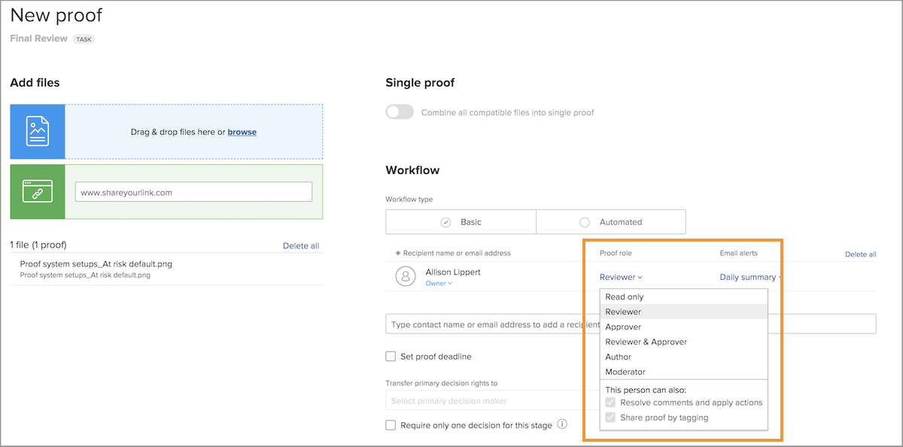
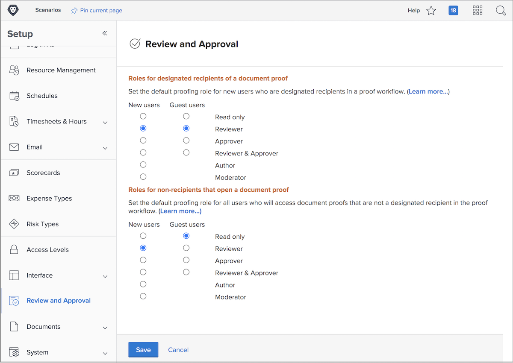

# Standaardproefdrukrollen instellen

<!---
21.4 updates have been made
--->

De eerste standaardinstelling die moet worden voltooid, bepaalt de standaardproefrol die wordt toegewezen wanneer nieuwe gebruikers worden gemaakt of personen een proefdruk openen.

Proefrollen bepalen wat een gebruiker met een proef-enkel blik het kan doen, commentaren maken, het goedkeuren, etc. [!DNL Workfront] Het verdient aanbeveling standaardinstellingen voor de proefdrukrol in te stellen voor alle gebruikers, zodat ontvangers sneller en gemakkelijker aan proefdrukken kunnen worden toegevoegd en werkstromen sneller en eenvoudiger kunnen worden ingesteld.

Deze standaardproefrol kan echter worden gewijzigd wanneer afzonderlijke proefdrukken worden geüpload, zodat iedereen in staat is de rol te vervullen die hij in het beoordelings- en goedkeuringsproces nodig heeft.

## Standaardproefdrukrollen instellen

1. Selecteren **Instellen** van de [!UICONTROL Main Menu].
1. Selecteren **Revisie en goedkeuring** in het linkermenu.
1. Klik op de knop naast de gewenste standaardproefrol voor beide nieuwe [!DNL Workfront] gebruikers en gebruikers van gastproefdrukken voor &quot;aangewezen ontvangers&quot; — iedereen die aan het proefdrukwerkschema wordt toegevoegd, of manueel of door een werkschemamalplaatje.
1. Klik op de knop naast de gewenste standaardproefrol voor beide nieuwe [!DNL Workfront] gebruikers en gebruikers van gastproefdrukken voor &quot;niet-ontvankelijke&quot;gebruikers. Deze zijn over het algemeen [!DNL Workfront] gebruikers die toegang hebben tot een proefdruk, maar die geen van de personen zijn die aan de werkstroom zijn toegewezen.
1. Sla de wijzigingen op.

Bedenk wat de meeste gebruikers en gasten van uw account verwachten als ze aan een proefwerkstroom worden toegevoegd. Dit moet uw standaardinstelling zijn.
