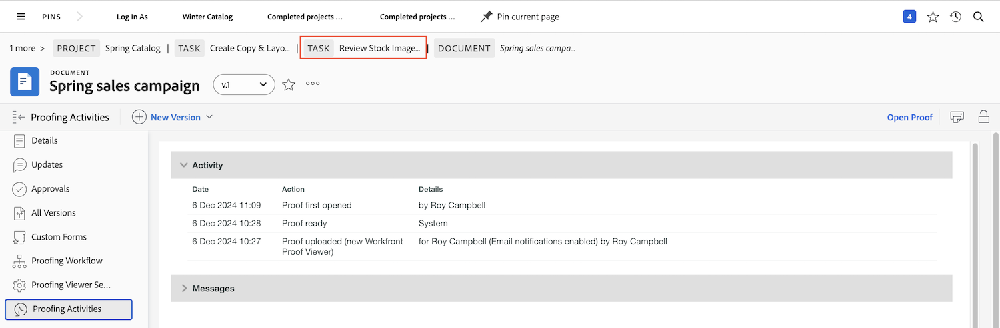

# Details van proefdrukken begrijpen

## Details van proefdrukken weergeven

Als proefdrukmanager of eigenaar kunt u dieper in de details achter een proef door het samenvattingspaneel en [!UICONTROL Document Details] pagina. Begin met het zoeken van uw proefdruk in het dialoogvenster [!UICONTROL Documents] van een project, taak of kwestie.

### Het deelvenster Samenvatting

In het overzichtsvenster vindt u een uitgebreid overzicht van de basisgegevens van de proefdruk. Gebruik het pictogram om het paneel uit te vouwen wanneer u het nodig hebt en het samen te vouwen wanneer u het niet hebt. U kunt zelfs de muis boven de miniatuur van de proefdruk houden om deze te openen of te downloaden.

![Een afbeelding van de [!UICONTROL Documents] van een project waarbij een proefdruk is geselecteerd en het deelvenster Samenvatting is uitgevouwen. Zowel het pictogram van het deelvenster Samenvatting als het deelvenster Overzicht worden gemarkeerd.](assets/document-summary.png)

Opmerking: De [!UICONTROL Approvals] in het overzichtsvenster is **document** goedkeuringen en **is niet** gekoppeld aan het beoordelings- en goedkeuringsproces voor proefdrukken waarover u in deze cursus hebt geleerd. De twee processen zijn gescheiden in [!DNL Workfront].

### [!UICONTROL Document Details]

Als u meer informatie over de proefdruk nodig hebt, kunt u het [!UICONTROL Document Details] via de koppeling gaat u naar de proefdrukpagina in [!DNL Workfront].

![Een afbeelding van de proefdrukpagina in [!DNL  Workfront].](assets/document-details.png)

Houd er rekening mee dat de informatie over het proefdrukproces afhankelijk is van uw proefdrukmachtigingen in [!DNL Workfront].

Via de proefdrukpagina hebt u toegang tot de volgende secties via het menu van het linkerdeelvenster:

* **Updates —** Opmerkingen die zijn gemaakt in de proefdrukviewer worden hier weergegeven, met een &quot;proefdrukopmerking&quot;-tag. U kunt ook opmerkingen maken over het bestand, net zoals u opmerkingen maakt over een taak of project (deze opmerkingen worden niet weergegeven in de proefdrukviewer).
* **Goedkeuringen —** Dit deel is bedoeld voor documentgoedkeuringen, niet voor het testen van goedkeuringen. De twee soorten goedkeuringen zijn afzonderlijke processen in [!DNL Workfront] en niet aan elkaar koppelen. Als u proefdrukworkflows gebruikt voor revisies en goedkeuringen, gebruikt u deze sectie niet.
* **Alle versies —** De versiegeschiedenis van de proefdruk bijhouden en beheren. Het is misschien gemakkelijker om deze gegevens te openen in het overzichtsvenster op het tabblad [!UICONTROL Documents] lijst.
* **Aangepaste Forms —** Aangepaste formulieren worden gebruikt op proefdrukken om organisatiespecifieke informatie vast te leggen. Deze informatie kan samen met het bestand worden doorgegeven aan geïntegreerde documentopslagsystemen, zoals [!DNL Workfront] DAM of [!DNL Adobe’s] AEM. Aangepaste formulieren worden ingesteld door uw [!DNL Workfront] systeembeheerder of groepsbeheerder. Bespreek met uw team of uw beheerders of u aangepaste formulieren op proefdrukken wilt gebruiken.
* **Proofingworkflow —** De workflow die aan de proefdruk is toegewezen, beheren of wijzigen. U kunt dit venster openen met de [!UICONTROL Proofing Workflow] koppeling op het bewijs in het [!UICONTROL Documents] ook. Leer hoe u wijzigingen aanbrengt in de workflow met de video Een proefwerkstroom bewerken.

Laten we eens nader naar twee van de volgende secties kijken: [!UICONTROL Proofing Viewer Settings] en [!UICONTROL Proofing Activity].

### [!UICONTROL Proofing Viewer Settings]

Met deze instellingen kunt u de toegang tot de proefdruk zelf beheren.

![Een afbeelding van de [!UICONTROL Proofing Viewer Settings] op de proefdrukpagina met de [!UICONTROL Proofing Viewer Settings] gemarkeerd in het menu van het linkerdeelvenster.](assets/proofing-settings-on-details-page.png)

* **[!UICONTROL Require login. This proof cannot be shared with guest users]—** Het bewijs kan alleen worden gedeeld met personen die een [!DNL Workfront] bewijs van bevoegdheid.
* **[!UICONTROL Require decisions to be electronically signed]—** Wanneer u een proefdruk deelt, moet de ontvanger over proefdrukmachtigingen beschikken in [!DNL Workfront] en maakt van hen &quot; elektronisch &quot; het bewijs door hun bewijswachtwoord in te voeren wanneer zij een bewijskrachtbesluit nemen . (Opmerking: Het proefdrukwachtwoord is anders dan uw [!DNL Workfront] wachtwoord. Het wachtwoord voor proefdrukken is niet gemakkelijk toegankelijk, zodat de meeste ontvangers dit wachtwoord niet weten.) [!DNL Workfront] raadt u aan contact op te nemen met uw [!DNL Workfront] consultant voordat deze functie wordt gebruikt.
* **[!UICONTROL Lock proof when all required decisions are made ]—** Dit bevestigt het bewijs voor eventuele verdere opmerkingen, antwoorden, besluiten, enz., zodra elk besluit over het bewijs is genomen. Hierdoor wordt de hele proefversie vergrendeld, niet alleen een specifiek stadium van de proefdrukworkflow.
* **[!UICONTROL Allow downloading the original file]—** Ontvangers van proefdrukken kunnen het oorspronkelijke bronbestand van de proefdruk downloaden vanuit de proefdrukviewer (de optie staat in het rechterdeelvenstermenu).
* **[!UICONTROL Allow sharing proof via public URL or embed code]—** Ontvangers van bewijzen kunnen een openbaar toegankelijke proefkoppeling met iedereen delen.
* **[!UICONTROL Allow subscribing to proof via public URL or embed code]—** Iedereen die de openbare URL heeft ontvangen, kan zich aan de proef toevoegen met zijn e-mailadres en naam (als het geen proefgebruikers is) of met zijn e-mailadres en wachtwoord voor het proefdrukken (als het een proefdrukgebruiker is). (Opmerking: Het proefdrukwachtwoord is niet hetzelfde als een [!DNL Workfront] wachtwoord.)

Deze instellingen kunnen ook worden ingesteld wanneer de proefdruk wordt geüpload in het dialoogvenster [!UICONTROL Proof settings] onder aan het uploadvenster.

![Een afbeelding van de [!UICONTROL Proof settings] onder aan het uploadvenster.](assets/proof-settings-on-upload-page.png)

### [!UICONTROL Proofing Activity]

Op deze pagina worden alle activiteiten bijgehouden die op de proefdruk zijn uitgevoerd, plus de e-mailberichten die met betrekking tot deze proefdruk zijn verzonden.

![Een afbeelding van de [!UICONTROL Proofing Activity] van de proefdrukpagina met de [!UICONTROL Proofing Activity] gemarkeerd in het menu van het linkerdeelvenster.](assets/proofing-activity-in-details.png)

De [!UICONTROL Activity] tijdstempels van secties waarin opmerkingen en beslissingen zijn gemaakt, plus wie deze heeft gemaakt. Ook wordt bijgehouden wanneer testwerkstroomfasen zijn gestart, wanneer een ontvanger voor het eerst een proefdruk heeft geopend en andere informatie die een bewijsleider of eigenaar wil weten. Deze details kunnen handig zijn wanneer u bijvoorbeeld probeert uit te zoeken waarom een werkstroomstadium voor het testen nooit is uitgeschakeld.

De [!UICONTROL Messages] de tijdstempels van de sectie wanneer de e-mailalarm en de berichten werden verzonden naar ontvangers, die hen, en de inhoud van het bericht verzonden. Dit kan handig zijn wanneer u problemen oplost als iemand zegt dat hij geen e-mail over een proefdruk heeft ontvangen. U kunt controleren of en wanneer een e-mail is verzonden.

[!DNL Workfront] raadt de bewijsleider en de eigenaar van het bewijs aan de informatie in deze twee secties te kennen. Wanneer u deze gegevens combineert met inzicht in de manier waarop u de [!UICONTROL SOCD] op de voortgangsbalk kunt u uw proefdrukken echt begrijpen en beheren, waar ze zich ook bevinden in de proefwerkstroom.

Wanneer u klaar bent met het werken in het dialoogvenster [!UICONTROL Document Details] gebruik de broodkruimelbaan om terug te keren naar de [!UICONTROL Documents] deel van het project, de taak, of geeft het bewijs uit is in bijlage aan.

<!--
#### Learn more
* [!UICONTROL Document details] overview
* Add a custom form to a document
* Request document approvals
* Summary for documents overview
* View activity on a proof within [!DNL Workfront]
-->
